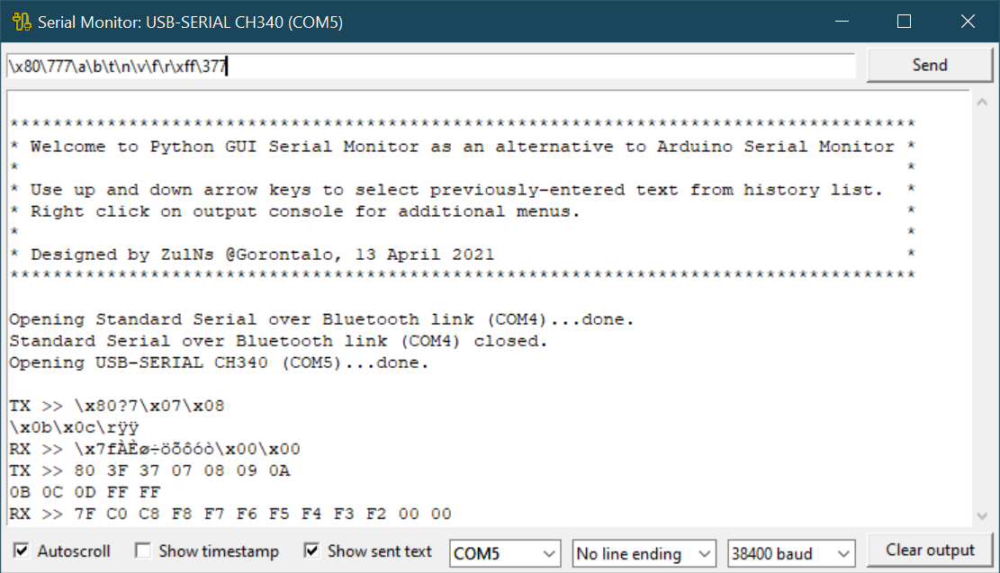
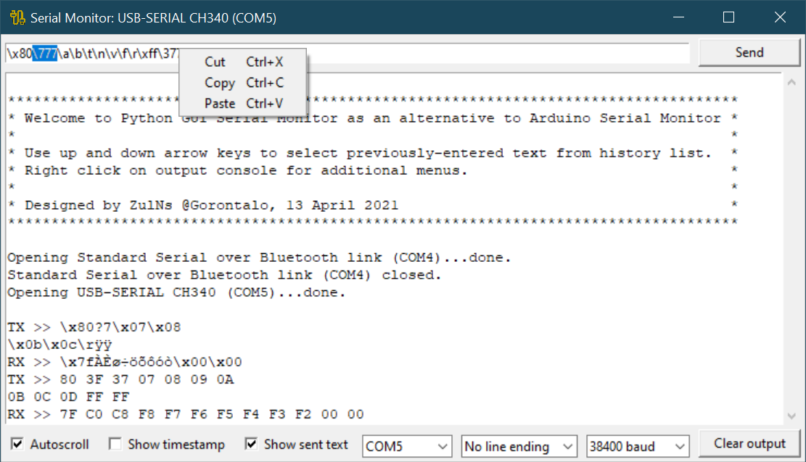
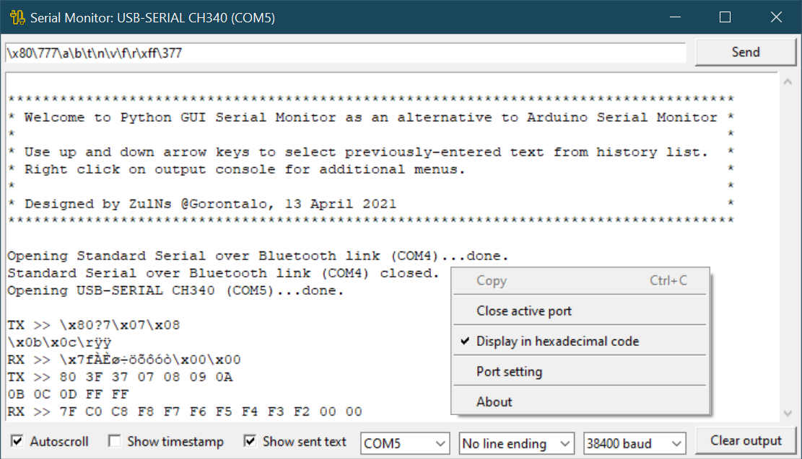
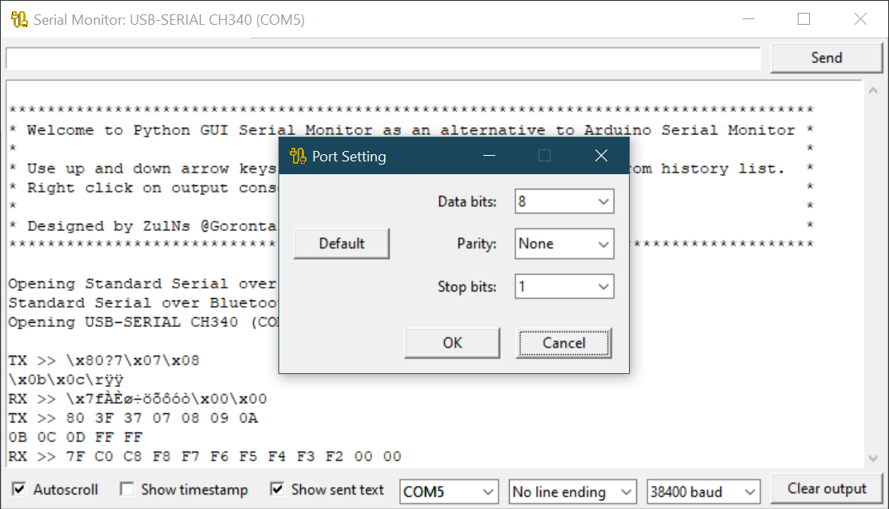
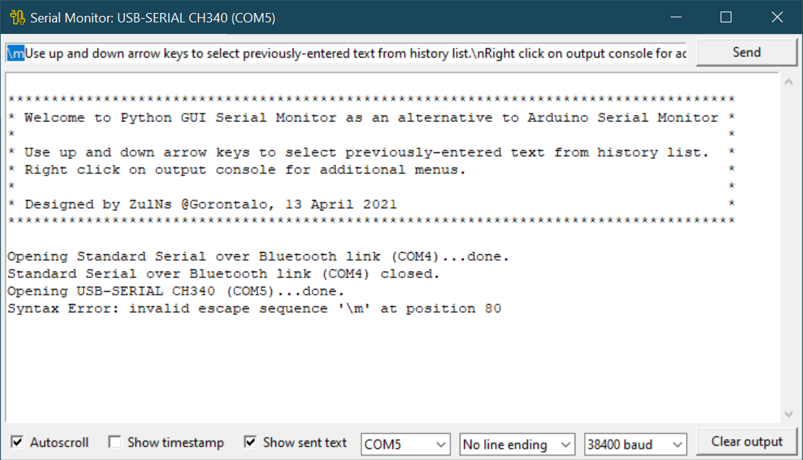
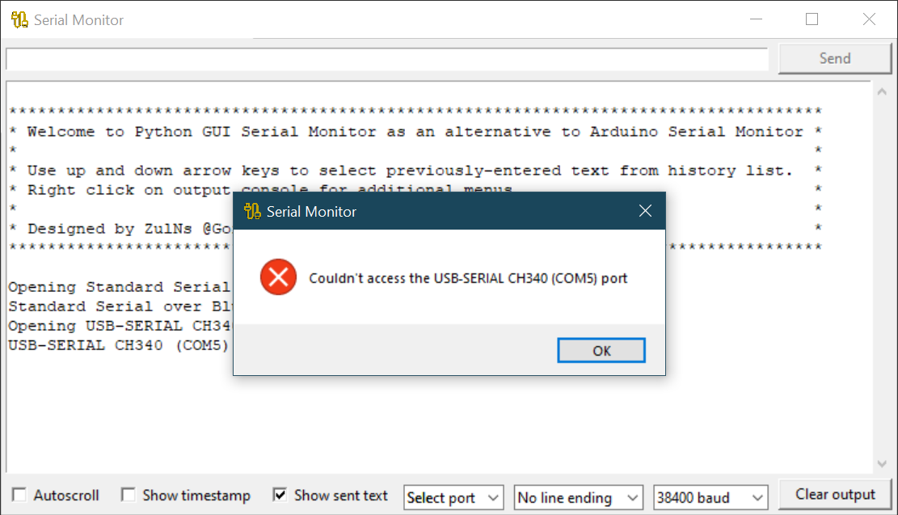

# Python GUI Serial Monitor
### As an alternative to Arduino Serial Monitor, a GUI built with [*tkinter*](https://docs.python.org/3/library/tkinter.html).

## Dependencies
- [Python 3.8.6](https://www.python.org/downloads/release/python-386/)
- [pySerial v3.5](https://pyserial.readthedocs.io/en/latest/)

## How to install pyserial
`python -m pip install pyserial`

## How to launch
`python serial_monitor.pyw`

## Key features
- Supports interactive display for both received and transmitted characters as well as show timestamp.
- Supports use of 8-bits escape sequence for both `\xXX` (hexadecimal `\x00` to `\xff`) and `\OOO` (octal `\000` to `\377`) to send to. Escape characters `\\`&nbsp;(backslash), `\'`&nbsp;(single quote), `\"`&nbsp;(double&nbsp;quote), `\0`&nbsp;(null), `\a`&nbsp;(bell), `\b`&nbsp;(backspace), `\t`&nbsp;(tab), `\n`&nbsp;(newline), `\v`&nbsp;(vertical tab), `\f`&nbsp;(form&nbsp;feed), and `\r`&nbsp;(carriage&nbsp;return) also supported. It also reports error on parsing with highlighted text.
- Maintains a history of texts you have sent. By using the up and down arrow keys, you can recall previously-entered texts from history list to the entry text line to send to.
- Supports display in hexadecimal code.
- Realtime port scanning and error reporting.
- A port can be selected from the list on the fly.
- All settings are maintained when closed, include current active port.

## List of files
| Filename | Description |
|:---------|:------------|
| [`serial_monitor.pyw`](serial_monitor.pyw) | Main Python script |
| [`serial_monitor.png`](serial_monitor.png) | Application icon |
| [`serial_monitor.cpython-38.pyw`](serial_monitor.cpython-38.pyw) | Python byte code generated by Python builtin module [`py_compile`](https://docs.python.org/3/library/py_compile.html) |
| [`serial_monitor.7z`](serial_monitor.7z) | Compressed standalone application for Windows (requires no Python), bundled by [`PyInstaller v4.3`](https://pyinstaller.readthedocs.io/en/stable/) |
| [`README.md`](README.md) | This readme |

## Demo with pictures

&nbsp;

***Fig. 1.*** *Serial Monitor in action.*

&nbsp;

***Fig. 2.*** *Entry console right click floating menus.*

&nbsp;

***Fig. 3.*** *Output console right click floating menus.*

&nbsp;

***Fig. 4.*** *Port setting child window.*

&nbsp;

***Fig. 5.*** *Error while parsing escape sequence character.*

&nbsp;

***Fig. 6.*** *Error message box popup when the current active serial port detached.*
